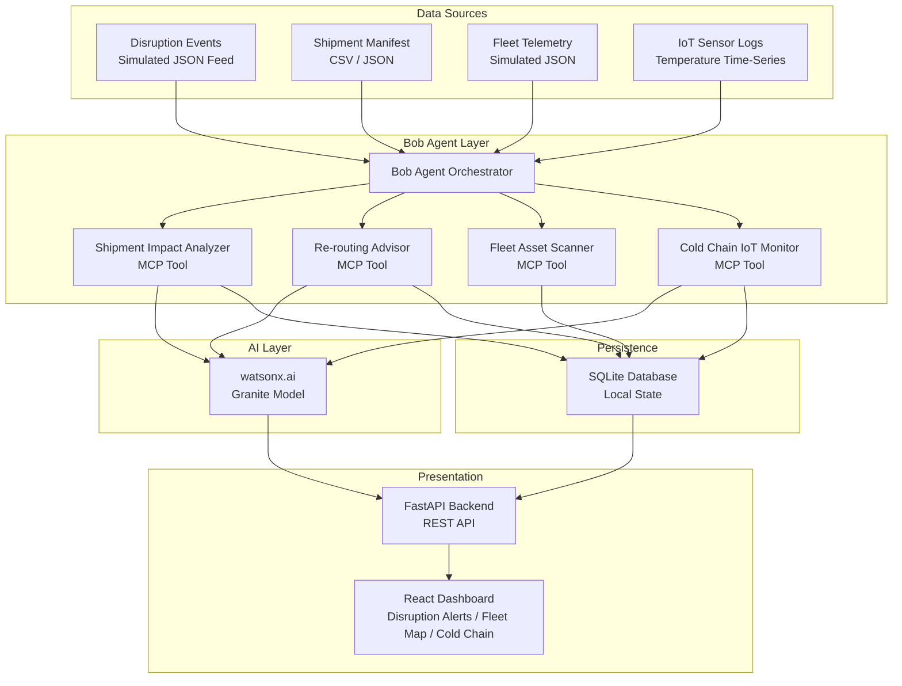

# Architecture

## System Architecture

The solution is structured as a Bob-orchestrated multi-tool pipeline. A central Bob agent coordinates four specialised analysis tools — each implemented as an MCP-registered Python function — and routes their outputs through watsonx.ai for AI-assisted reasoning before surfacing results to the React dashboard via a FastAPI backend.

## Components

| Component | Technology | Responsibility |
|---|---|---|
| **Bob Agent Orchestrator** | IBM Bob SDK (Python) | Receives operator queries or scheduled triggers; selects and chains the appropriate MCP tools; synthesises final recommendations |
| **Shipment Impact Analyzer** | Python MCP Tool | Cross-references active disruption events against shipment manifests to identify affected shipment legs and compute impact severity scores |
| **Re-routing Advisor** | Python MCP Tool + watsonx.ai | Takes an affected shipment and available carrier alternatives; calls the Granite model to produce a ranked rerouting recommendation with reasoning and delay estimates |
| **Fleet Asset Scanner** | Python MCP Tool | Scans simulated fleet telemetry to identify idle or under-utilised trucks, containers, and vessels near disrupted regions; ranks assets by proximity and capacity fit |
| **Cold Chain IoT Monitor** | Python MCP Tool + watsonx.ai | Reads IoT temperature sensor time-series logs; detects excursions or approaching threshold breaches; calls Granite to classify severity and recommend response action |
| **FastAPI Backend** | Python / FastAPI | Exposes REST endpoints consumed by the React dashboard; bridges the Bob agent outputs and SQLite state to the UI |
| **React Dashboard** | React 18 | Presents disruption alerts, affected shipment list, rerouting options, idle fleet map, and cold chain excursion reports in a unified operational view |
| **SQLite Database** | SQLite 3 | Stores seeded and runtime state: disruption events, shipment records, fleet telemetry snapshots, sensor readings, and analysis results |
| **watsonx.ai (Granite)** | IBM watsonx.ai API | Provides instruction-following inference for re-routing reasoning and cold chain severity classification |

## Data Flow

1. **Startup Seed** — On first run, the backend seeds the SQLite database from simulated JSON/CSV data files: disruption event catalogue, shipment manifest (100+ active shipments with multi-leg routes), fleet asset registry, and IoT temperature log history per refrigerated shipment.

2. **Disruption Detection** — The Shipment Impact Analyzer MCP tool is triggered (either by operator query or periodic scheduler). It reads current disruption events from the database, matches each event's affected region against active shipment legs, flags affected shipments, and writes impact severity scores back to the database.

3. **Rerouting Analysis** — For each shipment flagged as affected, the Re-routing Advisor MCP tool constructs a structured prompt (current route, disruption type, available carriers, cargo priority, delivery deadline) and sends it to the watsonx.ai Granite model. The response — a ranked alternative with plain-language reasoning — is stored and surfaced via the API.

4. **Fleet Redeployment Scan** — The Fleet Asset Scanner MCP tool reads fleet telemetry snapshots, computes idle status per asset (no active load, parked > threshold duration, within reachable distance of disrupted region), and produces a ranked redeployment suggestion list.

5. **Cold Chain Monitoring** — The Cold Chain IoT Monitor MCP tool scans all temperature sensor log streams for refrigerated shipments. Any reading outside the safe range for the cargo type, or trending toward the boundary, triggers a Granite classification call. The classified excursion record (severity level, cargo at risk, recommended action) is written to the database and surfaced as a priority alert on the dashboard.

## Security Considerations

- All API keys and sensitive credentials (`WATSONX_API_KEY`, `WATSONX_PROJECT_ID`, `WATSONX_URL`) are stored exclusively in a `.env` file that is excluded from version control via `.gitignore`. They are never hard-coded in source files.
- The `.env.example` file documents the required variables with placeholder values only, so the credential structure is visible to judges without exposing real keys.
- The FastAPI backend runs locally with no authentication layer in the hackathon prototype. In a production deployment, all API routes would require Bearer token authentication.
- The SQLite database file is local to the running environment and is not committed to the repository.

## Scalability Notes

The Bob agent model is horizontally composable: each MCP tool is a stateless Python function that reads from and writes to the database. In a production scenario, these tools could be deployed as independent microservices behind a message queue (e.g., IBM MQ or Kafka), allowing each analysis step to scale independently based on load. The watsonx.ai inference calls are the primary latency bottleneck under high shipment volume and would benefit from request batching and response caching for repeated route patterns. The React dashboard is stateless and can be served from any CDN or static host.
